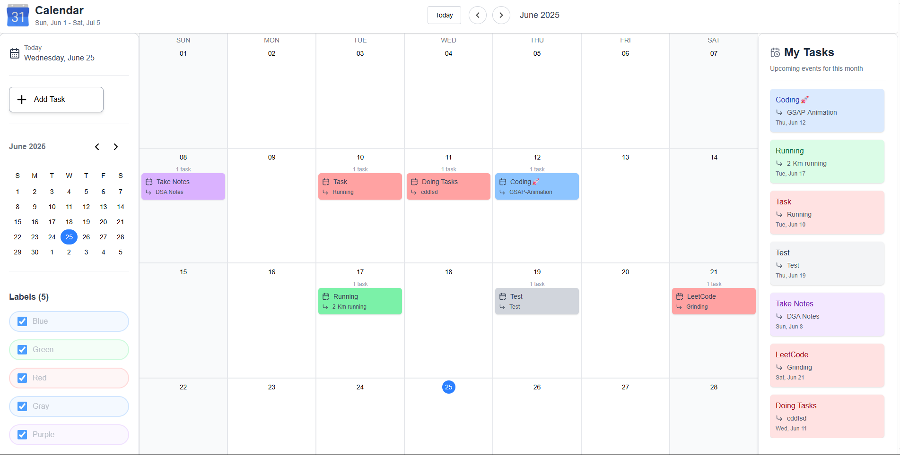

# 📅 Modern React Calendar Application

A modern, animated, and fully responsive calendar application built with the latest React 19 features, styled using TailwindCSS, and enhanced with GSAP animations.
## 🔗 Live Demo

👉 [Try it Now](https://calendarmns.vercel.app/)
---

## ✨ Features

- 🎨 Beautiful UI with **TailwindCSS**
- 📆 Powerful date handling using **dayjs** and **date-fns**
- 🌀 Smooth animations using **GSAP**
- ⚛️ Component-based structure
- 🌐 Context API for global state management
- ⚡ Lightning-fast development with **Vite**
- ✅ ESLint configured for consistent code
- 💡 TypeScript-friendly (via `@types` support)

---

## 🧩 Tech Stack

| Feature             | Technology                          |
|---------------------|--------------------------------------|
| Frontend Framework  | React 19.1.0                         |
| Build Tool          | Vite                                 |
| Styling             | TailwindCSS, Lucide React (icons)   |
| Animation           | GSAP (GreenSock)                    |
| Date Handling       | dayjs, date-fns                      |
| State Management    | React Context API                    |
                                      


## 🚀 Getting Started

Follow these steps to run the app locally:

### 1. Clone the repository

```bash
git clone https://github.com/NAVIN0507/calendar.git
cd calendar
npm install
npm run dev
```

🔧 Configuration
Make sure the following files exist and are correctly configured:

vite.config.js – for Vite bundler setup

eslint.config.js – for code linting rules

tailwind.config.js – for utility-first styling customization

🙌 Author
Created by Your Navin — contributions welcome!

